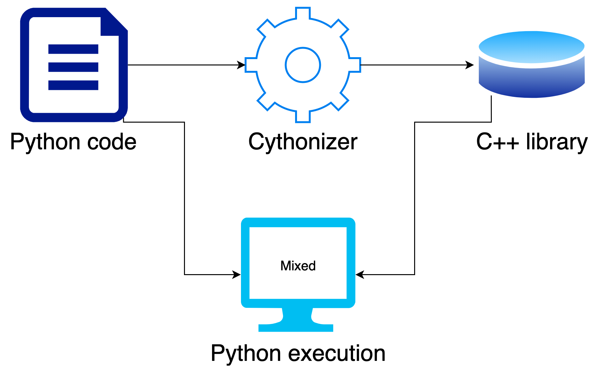

# Cythonizer

<p align="center">
    
</p>

Cythonizer is a tool for arranging structure of an existing folder and generate
a script, in order to compile the Python code inside the folder to C++ format as
`.so` files.

There are three modes, including `encrypt`, `decrypt`, and `clean`:
* `encrypt`: Rearrange the folder after backuping it, then generate a compile script.
* `decrypt`: Recover the original folder from the backup version.
* `clean`: Remove added files, namely setup.py, *.so.


## Installation
- OS: Ubuntu 18.04

- Python: 3.7

- Create a conda environment and install required packages:
```bash
# Create environment
conda create -n cythonizer python=3.7 -y
conda activate cythonizer

# Install required packages
conda install cython -y
```


-------
## Usage

* Encrypt a folder (with backup by default), then generate a script for compiling:
```bash
FOLDER="path_to_the_folder"
COMPILE_FILE="path_to_the_compile_script"
ROOT_DIR="path_to_the_parent_folder_of_the_examined_folder"

python cythonize_folder.py encrypt $FOLDER \
    --compile-file $COMPILE_FILE --root-dir $ROOT_DIR
```

* Decrypt a folder:
```bash
FOLDER="path_to_the_folder"
python cythonize_folder.py decrypt $FOLDER
```

* Clean a folder:
```bash
FOLDER="path_to_the_folder"
python cythonize_folder.py clean $FOLDER
```

* A complete example for mmdetection:
```bash
#!/usr/bin/env bash
set -e

MODE='encrypt' # encrypt, decrypt, clean
ROOT_DIR="/home/thuync/Workspace/RebarKnot/RebarKnotTrain"
COMPILE_FILE="$ROOT_DIR/scripts/compile.sh"
FOLDERS=(
	"$ROOT_DIR/mmdet/apis"
	"$ROOT_DIR/mmdet/core/anchor"
	"$ROOT_DIR/mmdet/core/bbox"
	"$ROOT_DIR/mmdet/core/bbox/assigners"
	"$ROOT_DIR/mmdet/core/bbox/coder"
	"$ROOT_DIR/mmdet/core/bbox/iou_calculators"
	"$ROOT_DIR/mmdet/core/bbox/samplers"
	"$ROOT_DIR/mmdet/core/evaluation"
	"$ROOT_DIR/mmdet/core/fp16"
	"$ROOT_DIR/mmdet/core/mask"
	"$ROOT_DIR/mmdet/core/post_processing"
	"$ROOT_DIR/mmdet/core/utils"
	"$ROOT_DIR/mmdet/datasets"
	"$ROOT_DIR/mmdet/datasets/pipelines"
	"$ROOT_DIR/mmdet/datasets/samplers"
	"$ROOT_DIR/mmdet/models"
	"$ROOT_DIR/mmdet/models/backbones"
	"$ROOT_DIR/mmdet/models/dense_heads"
	"$ROOT_DIR/mmdet/models/detectors"
	"$ROOT_DIR/mmdet/models/losses"
	"$ROOT_DIR/mmdet/models/necks"
	"$ROOT_DIR/mmdet/models/roi_heads"
	"$ROOT_DIR/mmdet/models/roi_heads/bbox_heads"
	"$ROOT_DIR/mmdet/models/roi_heads/mask_heads"
	"$ROOT_DIR/mmdet/models/roi_heads/roi_extractors"
	"$ROOT_DIR/mmdet/models/roi_heads/shared_heads"
	"$ROOT_DIR/mmdet/models/utils"
	"$ROOT_DIR/mmdet/ops"
	"$ROOT_DIR/mmdet/utils"
)

for FOLDER in "${FOLDERS[@]}"; do
	python cythonize_folder.py $MODE $FOLDER \
		--compile-file $COMPILE_FILE --root-dir $ROOT_DIR
done
```